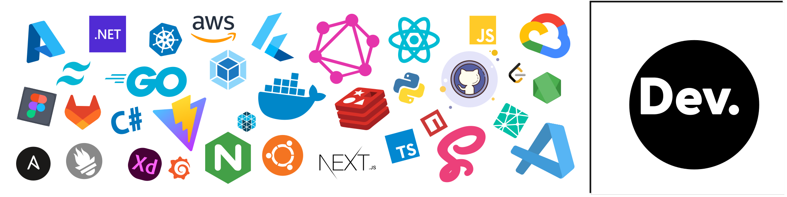

<h1 align="center">Hi , I'm Himanshu 😃 | Learner | Software Dev</h1>


## WhoAmI.js 

```JavaScript
const BehindTheCode = {
  user: "Himanshu Jayswal",
  college: "TATA Institute of Technology",
  technology: "MERN Stack",
  funFact:
    "Kind of programmer who doesn’t just learn concepts, turns them into projects.",
  learning: "LLMs",
  currentlyExploring: "AI / ML",
  hobbies: [
    "Music",
    "Editing",
    "Sci-Fi Movies"
  ],
  getCity() {
    return "Sidhi, Madhya Pradesh, India";
  },
  ambitions() {
    return "Become a Software Engineer";
  },
  experience() {
    return "Assistant Programmer at MPPKVVCL (MPEASTDISCOM)";
  }
};

```
<br>

## ⚙️ &nbsp;GitHub Analytics

<br>
<div align="center">
  

  


<p align="center">
  
  
</p>

</div>


<br>


## Languages and Tools

<p align="center"> 
  <a href="https://www.cprogramming.com/" target="_blank" rel="noreferrer">  </a> 
  <a href="https://www.w3schools.com/cpp/" target="_blank" rel="noreferrer">  </a> 
  <a href="https://www.w3schools.com/css/" target="_blank" rel="noreferrer">  </a> 
  <a href="https://www.w3.org/html/" target="_blank" rel="noreferrer">  </a> 
  <a href="https://developer.mozilla.org/en-US/docs/Web/JavaScript" target="_blank" rel="noreferrer">  </a> 
   <a href="https://developer.mozilla.org/en-US/docs/Web/" target="_blank" rel="noreferrer">  </a> 
   <a href="https://developer.mozilla.org/en-US/docs/Web/" target="_blank" rel="noreferrer">  </a> 
   <a href="https://developer.mozilla.org/en-US/docs/Web/" target="_blank" rel="noreferrer">  </a> 
  <a href="https://developer.mozilla.org/en-US/docs/Web/" target="_blank" rel="noreferrer">  </a> 
  <a href="https://developer.mozilla.org/en-US/docs/Web/" target="_blank" rel="noreferrer">  </a> 
 </p>

## Connect with Me

<p align="center">
  <a href="https://www.linkedin.com/in/himanshu-jayswal"></a>
  <a href="https://github.com/himanshujays29"></a>
 <a href="https://www.instagram.com/himanxu_jay/"></a>
<a href="https://x.com/HimanshuJaysw14"></a>

</p>

## Profile insights

<p align="center">
    <a href="https://github.com/">
        
    </a>
    <a href="https://github.com/himanshujays29">
    
	</a>
	 <a href="https://github.com/himanshujays29">
        
	</a>
</p>
